# A Practical Guide to Retrieval-Augmented Generation (RAG)

 ### THIS IS STILL A WORK IN PROGRESS AND HAS NOT BEEN COMPLETELY FACT-CHECKED 

## What is RAG?

Retrieval-Augmented Generation, usually abbreviated **RAG**, is a way to make a language model answer using information retrieved from an external knowledge source at inference time. Instead of relying only on the model’s parametric memory, a RAG system finds relevant material – such as documents, database records, web pages, manuals, or graph facts – and supplies that material to the model as context. [^1]

## Why do we have RAG?

We have RAG because a language model’s built-in knowledge is useful but limited in several practical ways:

1. **Its knowledge can be stale.** RAG lets the system retrieve current documents, policies, product information, or database records at answer time rather than relying only on information learned during training. [^1]

2. **It can hallucinate.** Language models generate plausible text, not guaranteed facts. Supplying relevant evidence gives the model material to ground its answer and can reduce unsupported claims. [^2][^3]

3. **It needs access to private or specialized knowledge.** A general model usually does not know an organization’s internal manuals, contracts, research documents, tickets, or current databases. RAG can connect it to those sources without retraining the model.

4. **Updating a knowledge base is easier than retraining a model.** New documents can be indexed, replaced, or removed while the underlying language model remains unchanged.

5. **It can improve traceability.** A system can show which passages or records supported an answer, making the output easier to review than a response based only on opaque model memory.

6. **It separates two jobs.** Retrieval finds relevant information; generation turns that information into a natural-language response. This separation makes it possible to improve search, reranking, filtering, or source selection independently of the language model. Surveys describe RAG as a combination of information retrieval and language generation designed to address the static limitations of model knowledge. [^2]

RAG is not a guarantee of truth. If retrieval returns irrelevant, incomplete, or outdated evidence, the model may still produce a poor answer. So the real purpose of RAG is to make answers **more current, domain-aware, evidence-grounded, and inspectable** – provided that the retrieval and evaluation layers are designed well.

A basic RAG request looks like this:

```text
User question
    ↓
Retrieve relevant evidence
    ↓
Insert evidence into the model's context
    ↓
Generate an answer grounded in that evidence
```

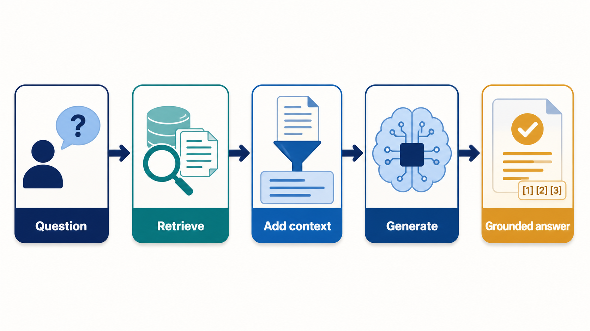

*Figure 1. RAG retrieves relevant evidence, adds it to the model's context, and generates a grounded answer.*

The purpose is not simply to “add search.” RAG separates **knowledge access** from **language generation**. The retriever is responsible for finding useful evidence; the generator is responsible for interpreting that evidence and producing an answer. This makes it possible to update a system’s knowledge by changing the indexed sources rather than retraining the entire language model. It also provides a route to more traceable answers, although retrieval mistakes can still produce incomplete, irrelevant, or misleading outputs.

A typical production RAG pipeline contains several stages:

1. **Ingestion** – collect documents and convert them into a searchable representation.
2. **Chunking and indexing** – split documents into passages and index them, often with dense embeddings, keyword indexes, or both.
3. **Query processing** – interpret, rewrite, expand, or decompose the user’s question.
4. **Retrieval** – select candidate passages or records.
5. **Reranking and filtering** – order candidates by relevance and remove weak evidence.
6. **Context construction** – fit the best evidence into the model’s context window.
7. **Generation** – ask the language model to answer using the supplied context.
8. **Evaluation and feedback** – measure retrieval quality, answer faithfulness, completeness, latency, and cost.

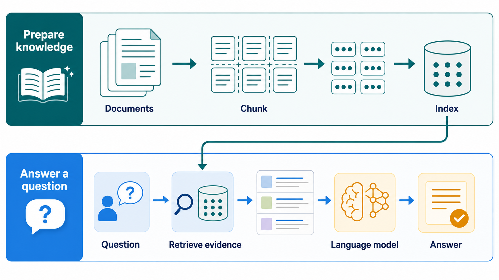

*Figure 2. Documents are prepared and indexed ahead of time; each question retrieves evidence from that shared index before the language model answers.*

The literature does not use one universally accepted taxonomy. Some surveys classify RAG by pipeline stage – pre-retrieval, retrieval, post-retrieval, and generation – while others classify it by architecture, robustness, or knowledge representation. [^2] The eight types below are therefore best understood as **overlapping design patterns**, not eight mutually exclusive boxes.

## 1. Naive RAG

**Naive RAG** is the baseline form of retrieval-augmented generation. The system embeds or searches the user’s question, retrieves a fixed number of passages, places them in the prompt, and asks the language model to answer.

### Typical architecture

```text
Question → embedding/search → top-k passages → prompt → answer
```

### Animated example

In this example, an employee asks, “How many annual leave days do employees get?” The system performs one search, retrieves a fixed set of three passages, builds a prompt from that evidence, and generates a cited answer.

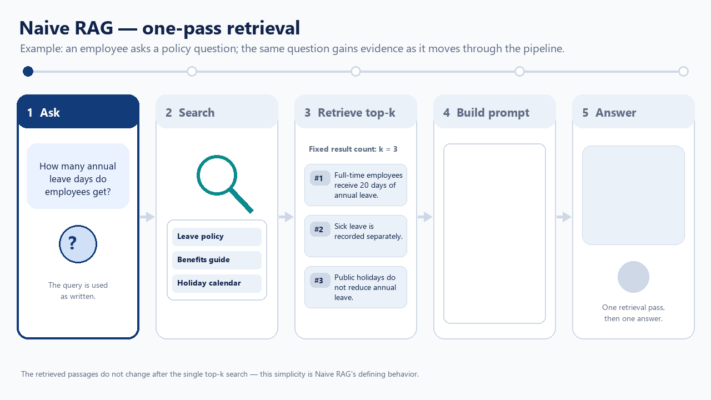

*Figure 4. A Naive RAG request uses the original question for one retrieval pass, adds the returned passages to the prompt, and generates an answer.*

### Strengths

- Fast to build and easy to understand.
- Often adequate for narrowly scoped document collections.
- Provides a useful baseline for evaluating more sophisticated designs.
- Can be inexpensive when retrieval and prompting are simple.

### Weaknesses

The baseline can retrieve passages that are lexically similar but not genuinely useful. It may also retrieve redundant chunks, miss the passage containing the answer, or provide context that is too fragmented for the model to interpret. A survey comparing baseline and enhanced RAG describes naive implementations as limited by retrieval precision and contextual coherence. [^3]

### When to use it

Use naive RAG for a prototype, a small internal corpus, or a problem where questions closely resemble the wording of the source documents. Do not treat it as a dependable production architecture until retrieval and answer quality have been measured on representative questions.

## 2. Advanced RAG

**Advanced RAG** improves the baseline by adding deliberate processing before and after retrieval. Common additions include better document parsing, semantic chunking, metadata filters, hybrid keyword-plus-vector search, query rewriting, reranking, context compression, and answer citations.

### Typical architecture

```text
Question
  → query rewriting or expansion
  → hybrid/vector retrieval
  → reranking and filtering
  → context compression
  → generation
```

### Animated example

In this example, an employee asks, “Can I carry unused leave into next year?” The system rewrites the vague question into a more searchable query, combines keyword and vector results, reranks the candidates, compresses the strongest evidence, and generates a cited answer.

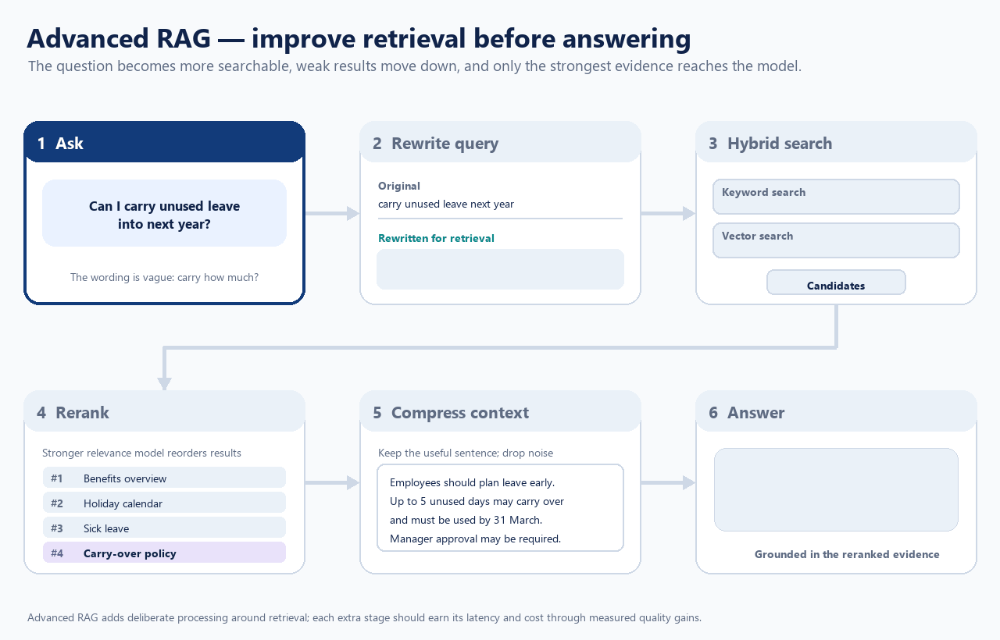

*Figure 5. Advanced RAG improves the evidence before generation: the carry-over policy moves from fourth place to first, and the relevant rule is isolated before the answer is written.*

A representative advanced pipeline adds query rewriting before retrieval and reranking afterward; one comparative study explicitly evaluated those two enhancements against a naive baseline. [^3]

### Why it helps

Advanced RAG addresses two common failure points: the system may misunderstand the user’s information need, and the initial retriever may return a poor ordering of otherwise relevant passages. Query rewriting can make an underspecified question more searchable. Reranking can then use a stronger relevance model to prioritize the passages most likely to answer it.

### Trade-offs

The improvements increase latency, engineering complexity, and operating cost. A reranker can also remove useful context if its relevance objective is too narrow. Advanced RAG is not automatically better: each additional stage should be evaluated against a baseline using questions that resemble real use.

## 3. Modular RAG

**Modular RAG** treats a RAG system as a collection of replaceable modules rather than one fixed pipeline. Retrieval, routing, query transformation, reranking, context compression, memory, tool use, and generation can be composed differently for different tasks.

### Typical architecture

```text
                    ┌─ keyword search ─┐
Question → router ──┼─ vector search ───┼→ rerank → compress → generate
                    └─ database tool ──┘
```

### Animated example

In this example, one employee question contains two different needs: a personal leave balance and a general carry-over rule. A router sends each need to the appropriate module, then combines the database result and policy evidence into one answer.

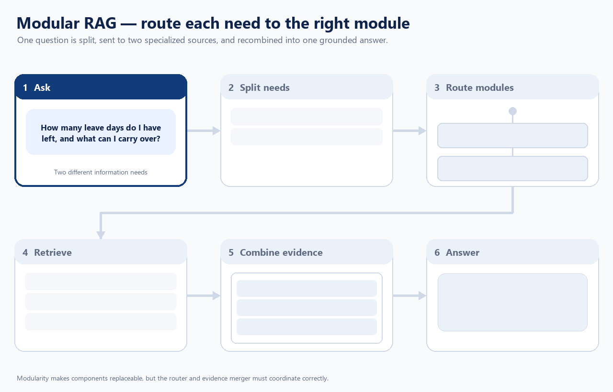

*Figure 6. Modular RAG routes different information needs to specialized sources and recombines their evidence.*

The defining idea is architectural flexibility. A modular system might route a policy question to a curated document index, a numerical question to a database, and a multi-hop question to a graph retriever.

### Strengths

- Individual components can be replaced or improved independently.
- Different query types can use different retrieval strategies.
- Experiments are easier to isolate and reproduce.
- The architecture can support multiple indexes, tools, and models.

### Weaknesses

Modules create coordination problems. A router may choose the wrong source, a compressor may discard a necessary qualification, or a reranker may optimize the wrong notion of relevance. Survey work identifies trade-offs involving modularity and coordination, alongside retrieval precision, generation flexibility, efficiency, and faithfulness. [^1]

### When to use it

Modular RAG is appropriate when the application has heterogeneous data sources or substantially different question types. It is often unnecessary for a small, homogeneous document collection.

## 4. Corrective RAG (CRAG)

**Corrective RAG**, commonly called **CRAG**, adds an explicit quality-control step after retrieval. The system assesses whether the retrieved evidence is sufficiently relevant and then takes corrective action if it is not.

### Typical architecture

```text
Question → retrieve → evaluate retrieval quality
                         ├─ good → use evidence → generate
                         └─ poor → rewrite, broaden, filter, or retrieve elsewhere
```

### Animated example

In this example, the first search for battery warranty coverage returns setup and charging material instead of a warranty rule. The quality check fails, so the system rewrites and filters the search before answering from stronger evidence.

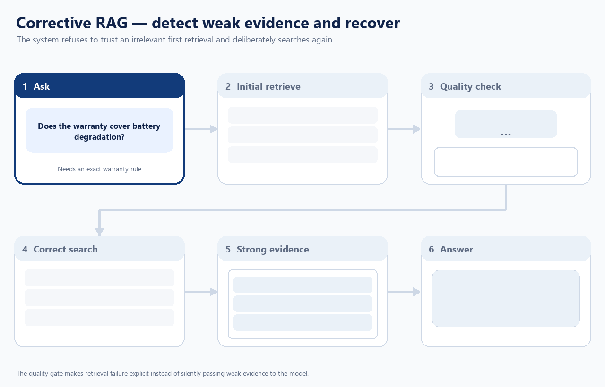

*Figure 7. Corrective RAG treats weak retrieval as a recoverable failure rather than silently passing irrelevant passages to the model.*

Correction can involve rewriting the question, searching a second index, expanding the retrieval scope, removing irrelevant passages, or declining to answer when adequate evidence cannot be found.

### What makes it different

Advanced RAG improves retrieval as a general pipeline. Corrective RAG makes **retrieval quality itself a decision point**. The system does not assume that the first search result is usable.

### Strengths

- Reduces the chance that irrelevant passages silently enter the prompt.
- Can recover from ambiguous queries and failed searches.
- Makes retrieval failure explicit rather than treating every retrieval as successful.

### Weaknesses

- The quality evaluator can be wrong.
- Repeated searches increase latency and cost.
- Aggressive correction can lead to unnecessary searching or answer refusal.

CRAG is especially useful when incorrect evidence is more damaging than a slower answer – for example, regulated enterprise workflows, technical support, or high-stakes knowledge retrieval.

## 5. Self-Reflective RAG / Self-RAG

**Self-reflective RAG**, often called **Self-RAG**, gives the model a role in deciding when retrieval is needed and in critiquing the evidence and answer. Rather than always retrieving a fixed number of passages, the model can retrieve selectively, assess relevance, and revise or qualify its response.

### Typical architecture

```text
Question → decide whether retrieval is needed
             ↓
        retrieve evidence
             ↓
      critique evidence and draft
             ↓
       revise, cite, or abstain
```

### Animated example

In this example, the model decides that a store-policy question requires retrieval. Its first draft applies the general 30-day return rule, but self-critique detects a conflict with the clearance-specific passage and revises the answer.

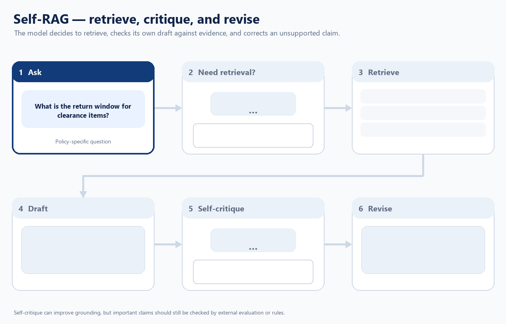

*Figure 8. Self-RAG uses reflection to detect that a draft conflicts with retrieved evidence and then revises the response.*

### What it is designed to address

A fixed retrieval policy can hurt performance in two opposite ways: it may retrieve unnecessary context for simple questions, or fail to retrieve enough evidence for difficult ones. Self-reflection attempts to make retrieval and answer construction more conditional.

### Strengths

- Retrieval can be selective instead of mandatory.
- The model can identify unsupported or weakly supported claims.
- The approach can support iterative revision and more explicit grounding.

### Weaknesses

Self-critique is not the same as reliable verification. A language model can confidently judge its own answer incorrectly, especially when the retrieved evidence is ambiguous or incomplete. Self-RAG therefore works best when reflection is combined with external checks, structured citations, answer evaluation, or deterministic business rules.

## 6. Adaptive or Iterative RAG

**Adaptive RAG** changes retrieval behavior according to the question, the retrieved evidence, or the intermediate answer. **Iterative RAG** performs retrieval in multiple rounds rather than completing the task with one search.

### Typical architecture

```text
Question → first retrieval → partial reasoning
                         ↓
                 identify missing evidence
                         ↓
                    second retrieval
                         ↓
                    final answer
```

### Animated example

In this example, the first retrieval identifies a port closure but cannot identify the affected suppliers. The system recognizes the missing relationship, performs a second targeted retrieval, and combines both rounds of evidence.

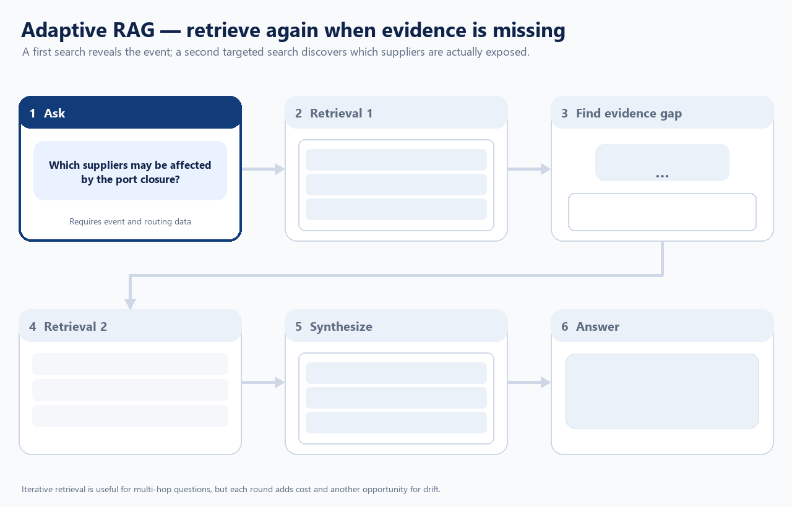

*Figure 9. Adaptive RAG changes its retrieval behavior after discovering that the first evidence set cannot complete the answer.*

This is useful for questions that require several pieces of evidence, such as comparing products, following a causal chain, or answering a multi-hop question. Survey work identifies adaptive retrieval, real-time retrieval, and structured reasoning over multi-hop evidence as important directions. [^1]

### Strengths

- Can gather evidence progressively.
- Better suited to multi-hop and underspecified questions.
- Can stop early for easy questions and search more deeply for hard ones.

### Weaknesses

- Errors can compound across retrieval rounds.
- The system may drift away from the original question.
- Latency and cost are less predictable.
- Evaluation must test not only the final answer but also the sequence of retrieval decisions.

Adaptive RAG is a strong choice when the information need cannot be represented by one static query. It is less attractive when response time must be tightly bounded.

## 7. Agentic RAG

**Agentic RAG** uses an agent-like controller to plan and execute retrieval. The controller may decompose a task, select among tools and indexes, decide which sub-question to investigate next, inspect intermediate results, and iterate until it has enough evidence.

### Typical architecture

```text
User task → planner
              ↓
   choose tool, index, or sub-question
              ↓
        retrieve and inspect
              ↓
      update plan or retrieve again
              ↓
             synthesize
```

### Animated example

In this example, an agent plans a vendor comparison, chooses database, document-search, and calculation tools, executes the plan, and then updates it when verification shows that the initially stronger vendor exceeds the budget.

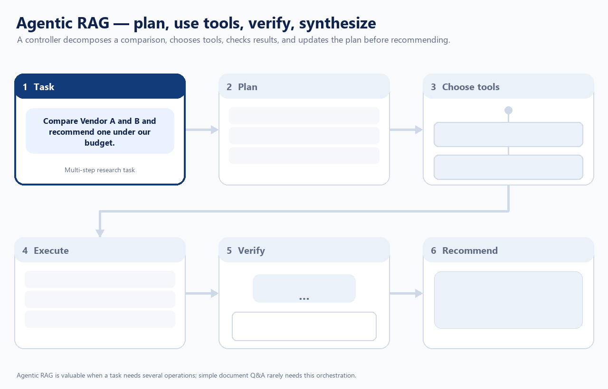

*Figure 10. Agentic RAG orchestrates several retrieval and reasoning operations, including changing the plan after inspecting intermediate results.*

### How it differs from adaptive RAG

The boundary is not absolute. Adaptive RAG emphasizes changing retrieval behavior; agentic RAG emphasizes **autonomous orchestration and tool selection**. An agentic system may therefore use adaptive retrieval, corrective evaluation, graph search, databases, web search, and calculators in the same workflow.

### Strengths

- Handles multi-step research tasks.
- Can combine different tools and knowledge sources.
- Makes it possible to separate planning, evidence gathering, verification, and synthesis.

### Weaknesses

- More opportunities for tool-selection, planning, and citation errors.
- Harder to debug than a fixed pipeline.
- Costs and latency can vary substantially between questions.
- The agent may perform unnecessary searches or follow an unproductive path.

Use agentic RAG when the task genuinely requires multiple operations. For simple document question answering, a well-evaluated non-agentic pipeline is usually easier to control.

## 8. GraphRAG

**GraphRAG** uses graph-structured knowledge – entities as nodes and relationships as edges – to retrieve and organize evidence. The graph may be constructed from documents, databases, ontologies, or a combination of sources. Graph structure is particularly useful when the answer depends on relationships rather than isolated passages. [^4]

### Typical architecture

```text
Question → entity and relation detection
          → graph traversal or graph retrieval
          → evidence organization
          → generation
```

### Animated example

In this example, the system detects supplier Acme as an entity, traverses the graph through Component C7, collects the paths to Products Alpha and Beta, and organizes those relationships as answer evidence.

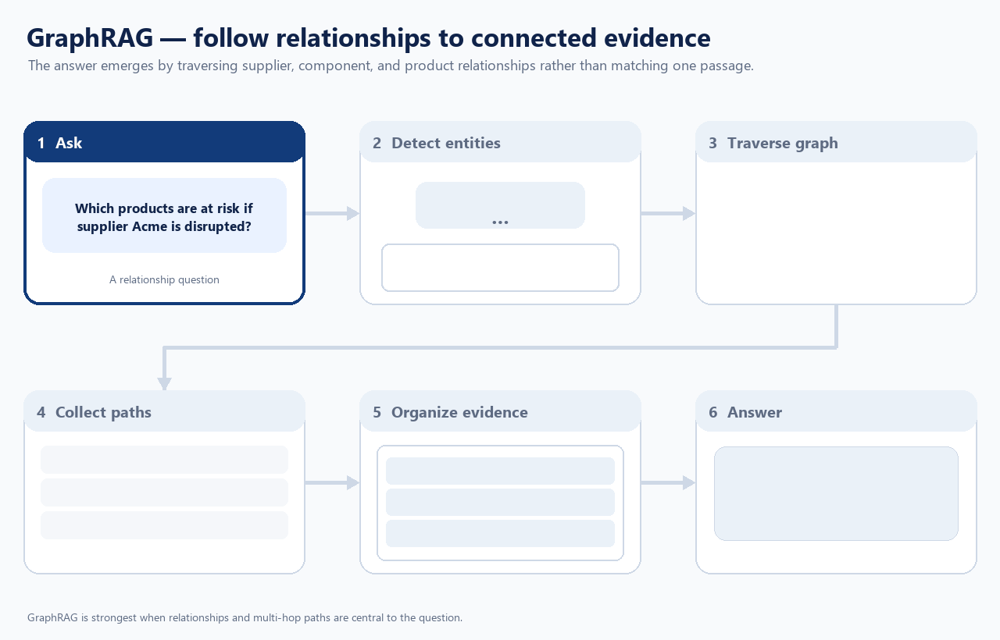

*Figure 11. GraphRAG answers a relationship question by following and citing multi-hop graph paths.*

A GraphRAG framework may explicitly separate the query processor, retriever, organizer, generator, and graph data source. [^4]

### Example use cases

- “Which targets are connected to this disease through human genetic evidence?”
- “Which companies have partnered with organizations that developed this technology?”
- “What pathway links the observed phenotype to the intervention?”
- “Which products depend on components supplied by vendors affected by an event?”

### Strengths

- Represents entities and relationships directly.
- Supports multi-hop questions and relational reasoning.
- Can combine structured facts with unstructured document evidence.
- Makes certain provenance relationships easier to inspect.

### Weaknesses

- Graph construction and maintenance are difficult.
- Missing or incorrect edges can distort retrieval.
- Graph schemas may be domain-specific and expensive to design.
- GraphRAG is not automatically superior for questions answered by one well-matched document passage.

GraphRAG should be viewed as a knowledge-representation choice as much as a retrieval choice. A system can also be graph-based and agentic, corrective, adaptive, or modular at the same time.

## How the eight types relate

The categories operate on different dimensions:

| Dimension | Examples |
|---|---|
| **Pipeline sophistication** | Naive RAG → Advanced RAG → Modular RAG |
| **Retrieval control** | Corrective RAG, Self-RAG, Adaptive RAG |
| **Orchestration** | Agentic RAG |
| **Knowledge representation** | GraphRAG |

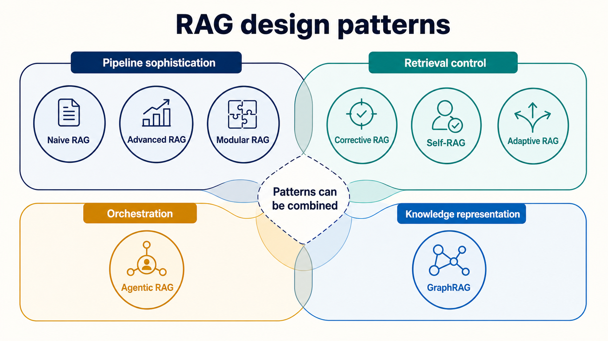

*Figure 3. The eight types describe different design dimensions and can be combined in one system.*

This is why a single system can have several labels. For example:

> A **modular, agentic GraphRAG** system could use a query planner to decide between vector search, keyword search, and graph traversal; apply a corrective relevance check; and iteratively retrieve additional evidence.

That description is more informative than forcing the system into one category.

## Choosing a RAG type

- Choose **Naive RAG** for a fast baseline or small prototype.
- Choose **Advanced RAG** when the baseline retrieves relevant material inconsistently.
- Choose **Modular RAG** when you have multiple data sources, query types, or interchangeable components.
- Choose **Corrective RAG** when bad retrieval is a major failure mode and recovery is worth the additional latency.
- Choose **Self-RAG** when retrieval should be selective and the system can benefit from explicit critique – but validate self-critique externally.
- Choose **Adaptive/Iterative RAG** for multi-hop or evolving information needs.
- Choose **Agentic RAG** for multi-step research and tool use, not merely because the application uses an LLM.
- Choose **GraphRAG** when entities, relationships, and multi-hop connections are central to the questions.

In practice, the best production design is often a combination: advanced retrieval with modular components, a corrective quality gate, adaptive retrieval for difficult questions, and GraphRAG or agentic orchestration only where the task requires them. The right choice depends less on the label than on the application’s retrieval errors, latency budget, data structure, auditability requirements, and evaluation set.


[^1]: Sharma, 2025. Retrieval-Augmented Generation: A Comprehensive Survey of Architectures, Enhancements, and Robustness Frontiers. arXiv.org.

[^2]: Huang & Huang, 2024. A Survey on Retrieval-Augmented Text Generation for Large Language Models. ACM Computing Surveys.

[^3]: Chakrabarty et al., 2025. From Naive to Advanced: Enhancing Question Answering with Retrieval-Augmented Generation. 2025 IEEE International Conference on Future Machine Learning and Data Science (FMLDS).

[^4]: Han et al., 2024. Retrieval-Augmented Generation with Graphs (GraphRAG). arXiv.org.
